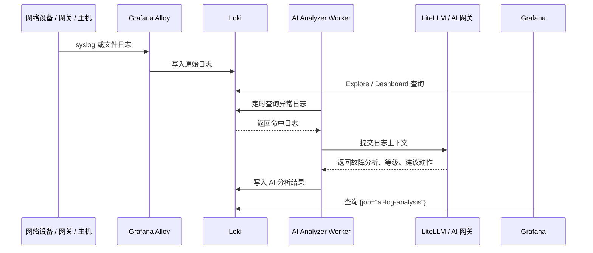

# 日志采集与自动分析架构图

## 总体架构

```mermaid
flowchart LR
  subgraph sources["日志来源"]
    windows["Windows 主机<br/>Event Log / 应用日志"]
    linux["Linux / Ubuntu 主机<br/>journald / file logs"]
    network["交换机 / 路由器 / 防火墙<br/>Syslog"]
    gateway["网关 / 代理 / VPN / Nginx<br/>access.log / error.log"]
    app["业务系统 / 中间件<br/>JSON / text logs"]
  end

  subgraph clients["采集端"]
    winAlloy["Windows Alloy Service<br/>采集 Windows Event Log"]
    linuxAlloy["Linux Alloy Agent<br/>采集文件 / journald"]
    syslogPush["设备直接发送 Syslog<br/>UDP/TCP 1514"]
    fileExport["日志文件落盘 / 同步目录<br/>/data/logs"]
  end

  subgraph server["内网日志服务器 Ubuntu + Docker"]
    alloy["Grafana Alloy<br/>Syslog Receiver + File Collector"]
    loki["Loki<br/>日志存储 / LogQL 查询"]
    grafana["Grafana<br/>Explore / Dashboard / 告警 / 插件页面"]
    worker["AI Log Analyzer Worker<br/>定时查询异常日志"]
  end

  subgraph ai["内网 AI 网关"]
    litellm["LiteLLM / DeepSeek / GLM<br/>统一模型接口"]
  end

  windows --> winAlloy
  linux --> linuxAlloy
  network --> syslogPush
  gateway --> fileExport
  app --> fileExport

  winAlloy -->|push /loki/api/v1/push| loki
  linuxAlloy -->|push /loki/api/v1/push| loki
  syslogPush -->|syslog tcp/udp| alloy
  fileExport -->|mounted logs| alloy

  alloy -->|write logs| loki
  loki -->|query logs| grafana

  worker -->|LogQL 查询异常日志| loki
  worker -->|发送日志上下文| litellm
  litellm -->|返回分析结论| worker
  worker -->|写回 {job="ai-log-analysis"}| loki
  grafana -->|展示 AI 分析结果| loki
```

## 数据流



## 推荐标签

```text
{job="network-syslog", source_type="network", device="fw-01"}
{job="central-file-log", source_type="gateway", service="nginx"}
{job="windows-eventlog", source_type="windows", host="wm-ex-0100"}
{job="ai-log-analysis", source_type="analysis", severity="P2"}
```

## 核心查询

```logql
{job="network-syslog"}
```

```logql
{job="central-file-log"}
```

```logql
{job="network-syslog"} |~ "(error|fail|denied|timeout|down|critical)"
```

```logql
{job="ai-log-analysis"}
```
